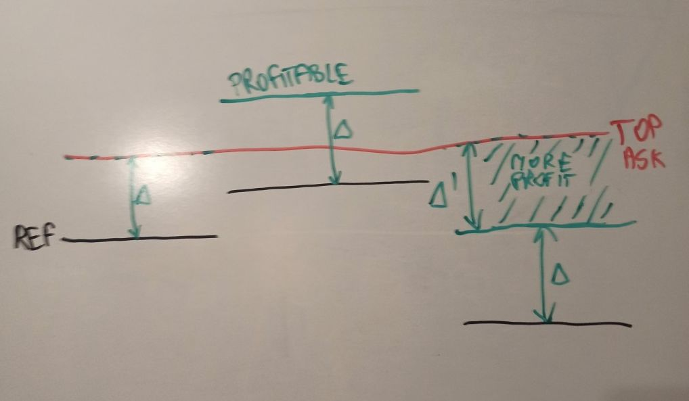
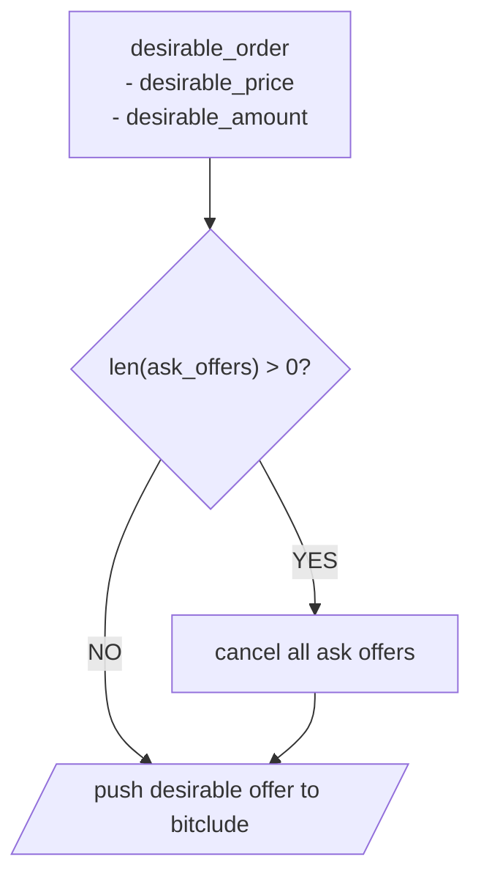
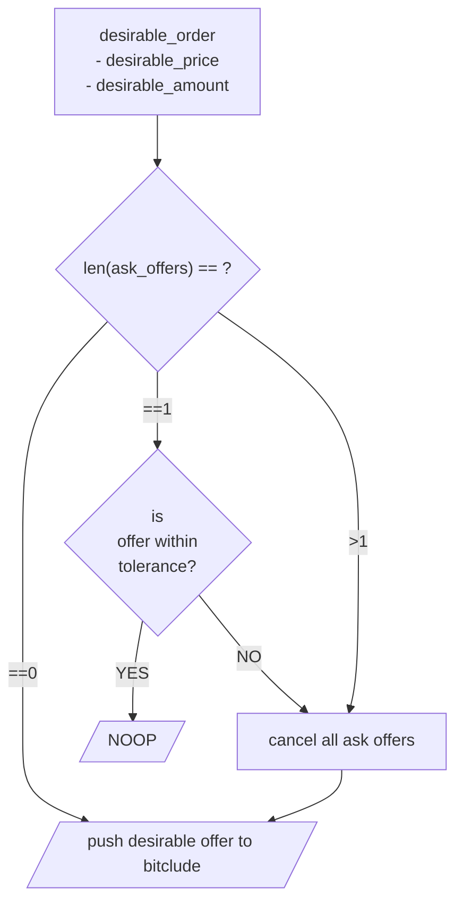

# nagasaki

```
poetry shell
poetry install
pylint --errors-only $(git ls-files '*.py')
```


[] Bidding ASK 
[] Hedging
[x] Added Hypothesis property based testing

Czy naprawiamy testy? 
[] 

Flow rzeczy

* Inicjalizacja stanu 
* Okresowe pobieranie kursu 
    - USD_PLN -> Trigeruje ASK/BID 
    - DERIBIT_BTC_USD  -> Triggeruje ASK/BID 
* Pobieranie kursu z bitclude na Websocketach Realtime -> Triggeruje ASK/BID 
* Refleksja na temat uzywania LMAX vs cos innego 

# yahoo finance api
wget https://www.yahoofinanceapi.com/yahoo-finance-api-specification.json

datamodel-codegen --input example/finance_quote.json --input-file-type json --output model.py
datamodel-codegen --input orderbook_btcpln.json --input-file-type json --output model.py

# strategy execution flow

# strategy


## get_actions_ask
- **REF** - cena referencyjna `USD_MARK_BTC * USD_PLN`
- **&Delta;** - arbitralny profit margin = `0.5%`
- **&epsilon;** - arbitralna wartość do przebijania TOP ASK = `0.01`
- **TOP_ASK** = `min(ask_orderbook)`
- **TOTAL_BTC** = BTC active + BTC inactive in Bitclude wallet

---

- **delta_price** = REF * (1+&Delta;)
- **epsilon_price** = TOP_ASK - &epsilon;
- **desirable_price** = `max(delta_price,epsilon_price)`
- **desirable_amount** = TOTAL_BTC

---

### v1



---

### v2




# TODO 21.04.2022
- [x] databse module in nagasaki (sqlite) [done]
- [ ] create models for
    - [ ] bitlcude_ticker (timestamp, bid, ask)
    - [x] actions (mapping from Action class) [done]
    - [ ] inventory (timestamp, bitclude_balances pln_active, pln_inactive, btc_active, btc_inactive)
- [ ] create handlers for writing above data to db
- [ ] switch to postgres
dry run
