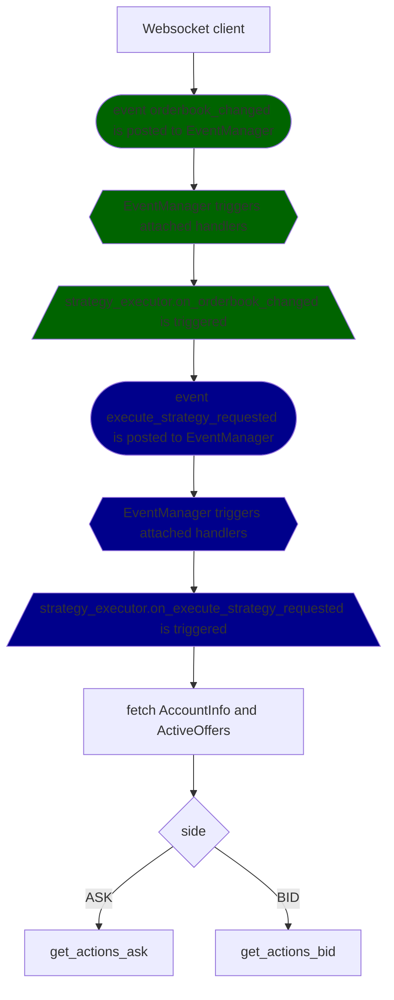
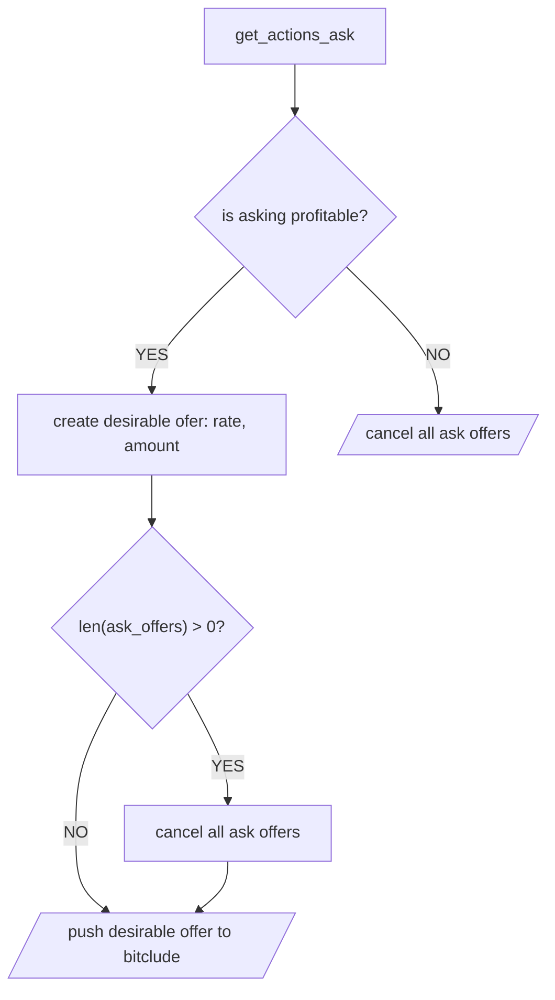
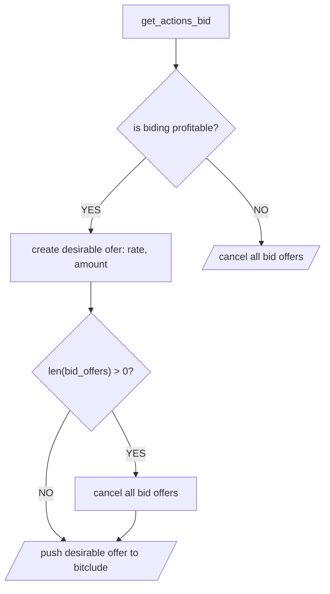

# nagasaki

```
poetry shell
poetry install
pylint --errors-only $(git ls-files '*.py')
```


[] Bidding ASK 
[] Hedging
[x] Added Hypothesis property based testing

Czy naprawiamy testy? 
[] 

Flow rzeczy

* Inicjalizacja stanu 
* Okresowe pobieranie kursu 
    - USD_PLN -> Trigeruje ASK/BID 
    - DERIBIT_BTC_USD  -> Triggeruje ASK/BID 
* Pobieranie kursu z bitclude na Websocketach Realtime -> Triggeruje ASK/BID 
* Refleksja na temat uzywania LMAX vs cos innego 

# yahoo finance api
wget https://www.yahoofinanceapi.com/yahoo-finance-api-specification.json

datamodel-codegen --input example/finance_quote.json --input-file-type json --output model.py

# strategy execution flow

# strategy
## get_actions_ask


## get_actions_bid
